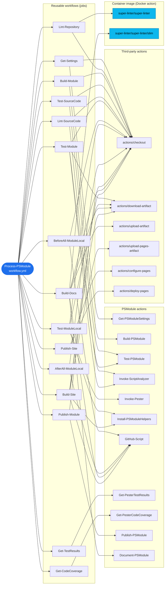
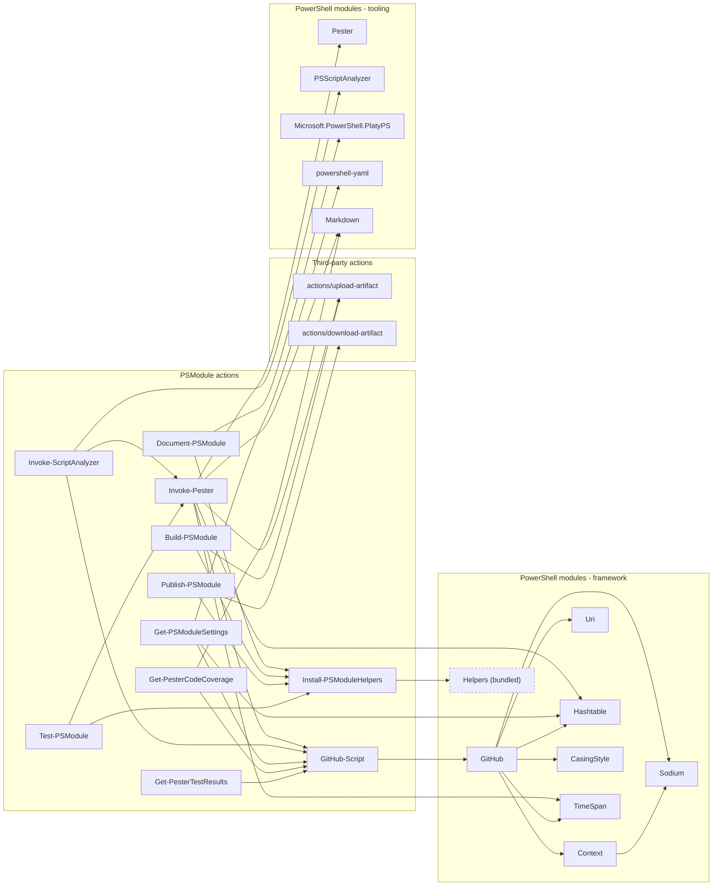
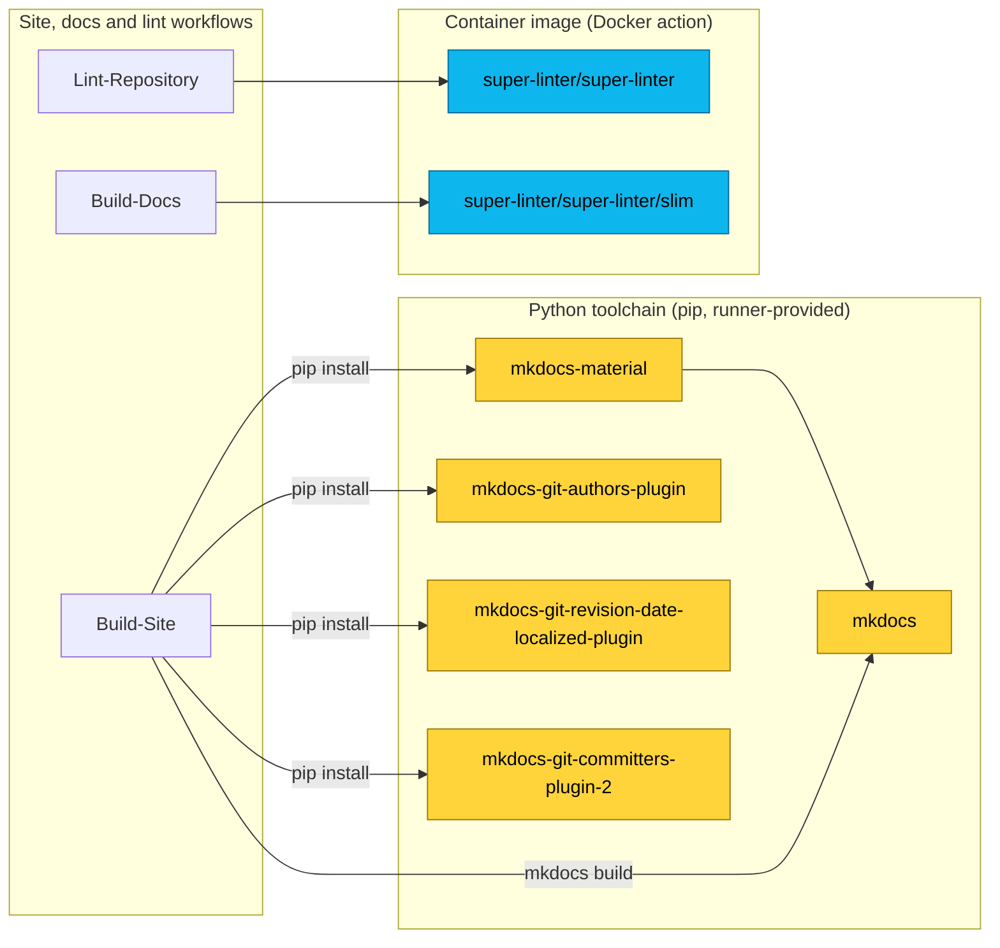

# Dependency tree

Process-PSModule is a reusable GitHub Actions workflow that composes the full PowerShell module lifecycle from many smaller, single-purpose building
blocks. This document maps its complete dependency tree: from the entry workflow, through the reusable workflows it calls, down to the actions,
container image, PowerShell modules, and Python packages that ultimately do the work.

The diagrams and tables below are built by reading the `uses:` entries and install steps in the workflow files under `.github/workflows/` and in each
action those workflows call.

- [Dependency tree](#dependency-tree)
  - [Dependency types](#dependency-types)
  - [Where the tree stops](#where-the-tree-stops)
  - [Workflow and action composition](#workflow-and-action-composition)
  - [Action foundation and PowerShell modules](#action-foundation-and-powershell-modules)
  - [Non-PowerShell toolchains](#non-powershell-toolchains)
  - [Dependency reference](#dependency-reference)
    - [Reusable workflows](#reusable-workflows)
    - [PSModule actions](#psmodule-actions)
    - [Third-party actions](#third-party-actions)
    - [PowerShell modules](#powershell-modules)
    - [Python packages](#python-packages)
  - [External registries and services](#external-registries-and-services)
  - [Auxiliary workflows](#auxiliary-workflows)
  - [Out of scope](#out-of-scope)
  - [Keeping this document current](#keeping-this-document-current)

## Dependency types

Process-PSModule depends on several distinct kinds of artifact. The tree tracks all of them:

| Layer | Type | What it is | Examples |
| --- | --- | --- | --- |
| 1 | Reusable workflows | GitHub Actions workflows called with `uses: ./...` | `workflow.yml` and 15 stage workflows |
| 2 | PSModule actions | Composite actions maintained in the PSModule organization | `GitHub-Script`, `Build-PSModule`, `Invoke-Pester` |
| 3 | Third-party actions | Actions maintained outside the PSModule organization | `actions/checkout`, `actions/deploy-pages` |
| 4 | Container image | A Docker action that runs a published image | `super-linter/super-linter` |
| 5 | PowerShell modules (framework) | Runtime modules that power the PSModule actions | `GitHub`, `Context`, `Sodium` |
| 6 | PowerShell modules (tooling) | Runtime modules that provide build, test, lint, and docs tools | `Pester`, `PSScriptAnalyzer`, `Microsoft.PowerShell.PlatyPS` |
| 7 | PowerShell module (bundled) | A module vendored inside an action instead of installed from a registry | `Helpers` |
| 8 | Python packages | `pip` packages installed to build the documentation site | `mkdocs-material` and MkDocs plugins |

## Where the tree stops

Each layer has a defined boundary so the tree stays finite and stable:

- **Reusable workflows** — the 15 stage workflows called by `workflow.yml`. They do not call further workflows.
- **PSModule actions** — expanded fully; the leaves are `GitHub-Script` and `Install-PSModuleHelpers`.
- **Third-party actions** — treated as leaves at the pinned commit. Their internal steps are not expanded.
- **Container image** — the leaf is the `super-linter` image. The many linters bundled inside it are not enumerated.
- **PowerShell modules** — expanded through their `RequiredModules` to the leaf modules. `Helpers` is a leaf because it ships inside the action.
- **Python packages** — the packages installed directly with `pip install`. Their transitive PyPI closure is left to `pip`.
- **Ambient runtimes and registries** — PowerShell, Python, Node.js, Git, the runner image, and the registries the artifacts come from are listed for
  context but not expanded.
- **Consumer dependencies** — the modules a repository declares with `#Requires -Modules` belong to that repository, not to Process-PSModule, and are
  out of scope.

## Workflow and action composition

The entry workflow `workflow.yml` calls 15 reusable workflows, one per lifecycle stage. Each workflow uses one or more actions. Shared actions such as
`actions/checkout` receive an edge from every workflow that uses them. `super-linter` is a Docker action and is shown as a container image.

## Action foundation and PowerShell modules

Most PSModule actions build on two foundations: `GitHub-Script`, which runs a script with the `GitHub` module installed and authenticated, and
`Install-PSModuleHelpers`, which loads a bundled `Helpers` module. The test, lint, and docs actions add their own tooling modules. At the bottom of the
tree, `GitHub` resolves its own `RequiredModules` from the PowerShell Gallery.

## Non-PowerShell toolchains

Two stages step outside PowerShell. `Build-Site` installs MkDocs and its plugins with `pip` and then runs `mkdocs build`. `Lint-Repository` and
`Build-Docs` run `super-linter`, a Docker action.

## Dependency reference

### Reusable workflows

The 15 stage workflows called by `workflow.yml`, in lifecycle order.

| Workflow | Stage | Key actions used |
| --- | --- | --- |
| Get-Settings | Load configuration | Get-PSModuleSettings |
| Lint-Repository | Repository linting | super-linter |
| Build-Module | Build the module | Build-PSModule |
| Test-SourceCode | Source code tests | Test-PSModule |
| Lint-SourceCode | Static analysis | Invoke-ScriptAnalyzer |
| Test-Module | Built-module tests | Invoke-ScriptAnalyzer, Test-PSModule |
| BeforeAll-ModuleLocal | Integration test setup | GitHub-Script |
| Test-ModuleLocal | Local integration tests | Install-PSModuleHelpers, Invoke-Pester |
| AfterAll-ModuleLocal | Integration test teardown | GitHub-Script |
| Get-TestResults | Aggregate test results | Get-PesterTestResults |
| Get-CodeCoverage | Aggregate code coverage | Get-PesterCodeCoverage |
| Publish-Module | Publish to the PowerShell Gallery | Publish-PSModule |
| Build-Docs | Generate documentation | Document-PSModule, GitHub-Script, super-linter |
| Build-Site | Build the documentation site | GitHub-Script, Install-PSModuleHelpers, MkDocs |
| Publish-Site | Deploy to GitHub Pages | actions/configure-pages, actions/deploy-pages |

### PSModule actions

Composite actions maintained in the [PSModule organization](https://github.com/PSModule).

| Action | Purpose | Depends on |
| --- | --- | --- |
| [GitHub-Script](https://github.com/PSModule/GitHub-Script) | Run PowerShell with the GitHub module installed | GitHub module |
| [Install-PSModuleHelpers](https://github.com/PSModule/Install-PSModuleHelpers) | Load the bundled Helpers module | Helpers (bundled) |
| [Get-PSModuleSettings](https://github.com/PSModule/Get-PSModuleSettings) | Read and resolve the settings file | GitHub-Script, powershell-yaml, Hashtable |
| [Build-PSModule](https://github.com/PSModule/Build-PSModule) | Compile source into a module | Install-PSModuleHelpers, actions/upload-artifact |
| [Test-PSModule](https://github.com/PSModule/Test-PSModule) | Run framework and module tests | Install-PSModuleHelpers, Invoke-Pester |
| [Invoke-Pester](https://github.com/PSModule/Invoke-Pester) | Run Pester test suites | GitHub-Script, actions/upload-artifact, Pester, Markdown |
| [Invoke-ScriptAnalyzer](https://github.com/PSModule/Invoke-ScriptAnalyzer) | Run PSScriptAnalyzer rules | GitHub-Script, Invoke-Pester, PSScriptAnalyzer |
| [Get-PesterTestResults](https://github.com/PSModule/Get-PesterTestResults) | Aggregate test results | GitHub-Script |
| [Get-PesterCodeCoverage](https://github.com/PSModule/Get-PesterCodeCoverage) | Aggregate code coverage | GitHub-Script, Markdown |
| [Publish-PSModule](https://github.com/PSModule/Publish-PSModule) | Publish to the PowerShell Gallery | Install-PSModuleHelpers, actions/download-artifact |
| [Document-PSModule](https://github.com/PSModule/Document-PSModule) | Generate documentation | Install-PSModuleHelpers, Microsoft.PowerShell.PlatyPS |

### Third-party actions

Actions maintained outside the PSModule organization, treated as leaves at their pinned commit.

| Action | Purpose |
| --- | --- |
| [actions/checkout](https://github.com/actions/checkout) | Check out the repository |
| [actions/download-artifact](https://github.com/actions/download-artifact) | Download build artifacts between jobs |
| [actions/upload-artifact](https://github.com/actions/upload-artifact) | Upload build and test artifacts |
| [actions/upload-pages-artifact](https://github.com/actions/upload-pages-artifact) | Package the site for GitHub Pages |
| [actions/configure-pages](https://github.com/actions/configure-pages) | Configure GitHub Pages |
| [actions/deploy-pages](https://github.com/actions/deploy-pages) | Deploy the site to GitHub Pages |
| [super-linter/super-linter](https://github.com/super-linter/super-linter) | Lint the repository and generated docs (Docker image) |

### PowerShell modules

Runtime modules installed from the PowerShell Gallery, except `Helpers`, which is bundled inside `Install-PSModuleHelpers`.

| Module | Owner | Role | Depends on |
| --- | --- | --- | --- |
| [GitHub](https://www.powershellgallery.com/packages/GitHub) | PSModule | GitHub API client used by GitHub-Script | Context, Uri, Hashtable, Sodium, CasingStyle, TimeSpan |
| [Context](https://www.powershellgallery.com/packages/Context) | PSModule | Credential and context store | Sodium |
| [Sodium](https://www.powershellgallery.com/packages/Sodium) | PSModule | Encryption helpers | — |
| [Uri](https://www.powershellgallery.com/packages/Uri) | PSModule | URI helpers | — |
| [Hashtable](https://www.powershellgallery.com/packages/Hashtable) | PSModule | Hashtable helpers | — |
| [CasingStyle](https://www.powershellgallery.com/packages/CasingStyle) | PSModule | String casing helpers | — |
| [TimeSpan](https://www.powershellgallery.com/packages/TimeSpan) | PSModule | Time span helpers | — |
| [Markdown](https://www.powershellgallery.com/packages/Markdown) | PSModule | Markdown generation for job summaries | — |
| [Pester](https://www.powershellgallery.com/packages/Pester) | Pester Team | Test runner | — |
| [PSScriptAnalyzer](https://www.powershellgallery.com/packages/PSScriptAnalyzer) | Microsoft | Static analysis rules | — |
| [Microsoft.PowerShell.PlatyPS](https://www.powershellgallery.com/packages/Microsoft.PowerShell.PlatyPS) | PowerShell team | Documentation generation | — |
| [powershell-yaml](https://www.powershellgallery.com/packages/powershell-yaml) | Community | YAML parsing for the settings file | — |
| Helpers | PSModule | Shared helpers bundled in Install-PSModuleHelpers | — (not published to a registry) |

### Python packages

Installed with `pip` in `Build-Site` to build the documentation site. Their transitive dependencies are resolved by `pip`.

| Package | Role |
| --- | --- |
| [mkdocs-material](https://pypi.org/project/mkdocs-material/) | Material theme for MkDocs (pulls in `mkdocs`) |
| [mkdocs-git-authors-plugin](https://pypi.org/project/mkdocs-git-authors-plugin/) | Adds Git author information to pages |
| [mkdocs-git-revision-date-localized-plugin](https://pypi.org/project/mkdocs-git-revision-date-localized-plugin/) | Adds localized revision dates to pages |
| [mkdocs-git-committers-plugin-2](https://pypi.org/project/mkdocs-git-committers-plugin-2/) | Adds committer information to pages |

## External registries and services

These are not nodes in the tree, but they are where the dependencies come from or where outputs go:

| Service | Used for |
| --- | --- |
| PowerShell Gallery | Installing and publishing PowerShell modules |
| PyPI | Installing the MkDocs packages |
| GitHub Container Registry | Pulling the super-linter image |
| GitHub API | Actions that read or write repository data |
| GitHub Pages | Hosting the published documentation site |
| GitHub Actions artifact storage | Passing build outputs between jobs |

Ambient runtimes are provided by the `ubuntu-latest` runner and are not expanded here: PowerShell, Python with `pip`, Node.js, and Git.

## Auxiliary workflows

These live in the repository but are not part of the reusable workflow consumers call. They automate maintenance of Process-PSModule itself:

| Workflow | Trigger | Purpose |
| --- | --- | --- |
| Release.yml | Pull requests that change `.github/workflows/**` | Releases new versions with `Release-GHRepository`, which builds on `GitHub-Script` |
| Linter.yml | Pull requests | Lints this repository with `super-linter` |
| Workflow-Test-Default.yml | Self-test | Runs `workflow.yml` with the default configuration |
| Workflow-Test-WithManifest.yml | Self-test | Runs `workflow.yml` with a manifest-based configuration |

## Out of scope

The modules a consuming repository declares with `#Requires -Modules` in its own source files are collected by `Build-PSModule` into the compiled
manifest, but they vary per repository and are not part of the Process-PSModule dependency tree.

## Keeping this document current

Version pins (commit SHAs and tags) are intentionally omitted here because they change often; the workflow files under `.github/workflows/` are the
source of truth. To refresh this document, re-read the `uses:` entries in those files and the install steps in each action, then update the diagrams
and tables above.
