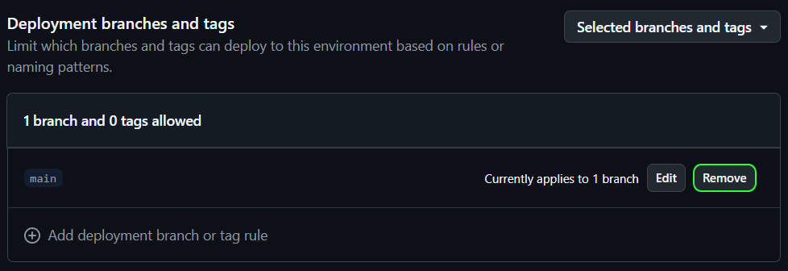

# Process-PSModule

A workflow for crafting PowerShell modules using the PSModule framework, which builds, tests, and publishes PowerShell modules to the PowerShell
Gallery and produces documentation that is published to GitHub Pages. The workflow is used by all PowerShell modules in the PSModule organization.

## How to get started

1. [Create a repository from the Template-Module](https://github.com/new?template_name=Template-PSModule&template_owner=PSModule&description=Add%20a%20description%20(required)&name=%3CModule%20name%3E).
1. Configure the repository:
   1. Enable GitHub Pages in the repository settings. Set it to deploy from `GitHub Actions`.
   1. This will create an environment called `github-pages` that GitHub deploys your site to.
      <details><summary>Within the environment, remove the branch protection for <code>main</code>.</summary>
      
      </details>
   1. [Create an API key on the PowerShell Gallery](https://www.powershellgallery.com/account/apikeys). Give it enough permission to manage the module you are working on.
   1. Create a new secret in the repository called `APIKEY` and set it to the API key for the PowerShell Gallery.
1. Create a branch, make your changes, create a PR and let the workflow run.

## How it works

The workflow is designed to be triggered on pull requests to the repository's default branch.
When a pull request is opened, closed, reopened, synchronized (push), or labeled, the workflow will run.
Depending on the labels in the pull requests, the workflow will result in different outcomes.


- [Get settings](./.github/workflows/Get-Settings.yml)
  - Reads the settings file from a file in the module repository to configure the workflow.
  - Gathers tests and creates test configuration based on the settings and the tests available in the module repository.
  - This includes the selection of what OSes to run the tests on.
- [Build module](./.github/workflows/Build-Module.yml)
  - Compiles the module source code into a PowerShell module.
- [Test source code](./.github/workflows/Test-SourceCode.yml)
  - Tests the source code in parallel (matrix) using:
    - [PSModule framework settings for style and standards for source code](https://github.com/PSModule/Test-PSModule?tab=readme-ov-file#sourcecode-tests)
  - This produces a json based report that is used to later evaluate the results of the tests.
- [Lint source code](./.github/workflows/Lint-SourceCode.yml)
  - Lints the source code in parallel (matrix) using:
    - [PSScriptAnalyzer rules](https://github.com/PSModule/Invoke-ScriptAnalyzer).
  - This produces a json based report that is used to later evaluate the results of the linter.
- [Framework test](./.github/workflows/Test-Module.yml)
  - Tests and lints the module in parallel (matrix) using:
    - [PSModule framework settings for style and standards for modules](https://github.com/PSModule/Test-PSModule?tab=readme-ov-file#module-tests)
    - [PSScriptAnalyzer rules](https://github.com/PSModule/Invoke-ScriptAnalyzer).
  - This produces a json based report that is used to later evaluate the results of the tests.
- [Test module](./.github/workflows/Test-ModuleLocal.yml)
  - Import and tests the module in parallel (matrix) using Pester tests from the module repository.
  - Supports setup and teardown scripts executed via separate dedicated jobs:
    - `BeforeAll`: Runs once before all test matrix jobs to set up test environment (e.g., deploy infrastructure, download test data)
    - `AfterAll`: Runs once after all test matrix jobs complete to clean up test environment (e.g., remove test resources, cleanup databases)
  - Setup/teardown scripts are automatically detected in test directories and executed with the same environment variables as tests
  - This produces a json based report that is used to later evaluate the results of the tests.
- [Get test results](./.github/workflows/Get-TestResults.yml)
  - Gathers the test results from the previous steps and creates a summary of the results.
  - If any tests have failed, the workflow will fail here.
- [Get code coverage](./.github/workflows/Get-CodeCoverage.yml)
  - Gathers the code coverage from the previous steps and creates a summary of the results.
  - If the code coverage is below the target, the workflow will fail here.
- [Build docs](./.github/workflows/Build-Docs.yml)
  - Generates documentation and lints the documentation using:
    - [super-linter](https://github.com/super-linter/super-linter).
- [Build site](./.github/workflows/Build-Site.yml)
  - Generates a static site using:
    - [Material for MkDocs](https://squidfunk.github.io/mkdocs-material/).
- [Publish site](./.github/workflows/Publish-Site.yml)
  - Publishes the static site with the module documentation to GitHub Pages.
- [Publish module](./.github/workflows/Publish-Module.yml)
  - Publishes the module to the PowerShell Gallery.
  - Creates a release on the GitHub repository.

## Usage

To use the workflow, create a new file in the `.github/workflows` directory of the module repository and add the following content.

<details>
<summary>Workflow suggestion</summary>

```yaml
name: Process-PSModule

on:
  pull_request:
    branches:
      - main
    types:
      - closed
      - opened
      - reopened
      - synchronize
      - labeled

concurrency:
  group: ${{ github.workflow }}-${{ github.ref }}
  cancel-in-progress: true

permissions:
  contents: write
  pull-requests: write

jobs:
  Process-PSModule:
    uses: PSModule/Process-PSModule/.github/workflows/workflow.yml@v2
    secrets:
      APIKEY: ${{ secrets.APIKEY }}

```
</details>

### Inputs

| Name | Type | Description | Required | Default |
| ---- | ---- | ----------- | -------- | ------- |
| `Name` | `string` | The name of the module to process. This defaults to the repository name if nothing is specified. | `false` | N/A |
| `SettingsPath` | `string` | The path to the settings file. Settings in the settings file take precedence over the action inputs. | `false` | `.github/PSModule.yml` |
| `Version` | `string` | Specifies the version of the GitHub module to be installed. The value must be an exact version. | `false` | `''` |
| `Prerelease` | `boolean` | Whether to use a prerelease version of the 'GitHub' module. | `false` | `false` |
| `Debug` | `boolean` | Whether to enable debug output. Adds a `debug` step to every job. | `false` | `false` |
| `Verbose` | `boolean` | Whether to enable verbose output. | `false` | `false` |
| `WorkingDirectory` | `string` | The path to the root of the repo. | `false` | `.` |

### Setup and Teardown Scripts

The workflow supports automatic execution of setup and teardown scripts for module tests:

- Scripts are automatically detected and executed if present
- If no scripts are found, the workflow continues normally

#### Setup - `BeforeAll.ps1`

- Place in your test directories (`tests/BeforeAll.ps1`)
- Runs once before all test matrix jobs to prepare the test environment
- Deploy test infrastructure, download test data, initialize databases, or configure services
- Has access to the same environment variables as your tests (secrets, GitHub token, etc.)

##### Example - `BeforeAll.ps1`

```powershell
Write-Host "Setting up test environment..."
# Deploy test infrastructure
# Download test data
# Initialize test databases
Write-Host "Test environment ready!"
```

#### Teardown - `AfterAll.ps1`

- Place in your test directories (`tests/AfterAll.ps1`)
- Runs once after all test matrix jobs complete to clean up the test environment
- Remove test resources, clean up databases, stop services, or upload artifacts
- Has access to the same environment variables as your tests

##### Example - `AfterAll.ps1`

```powershell
Write-Host "Cleaning up test environment..."
# Remove test resources
# Cleanup databases
# Stop services
Write-Host "Cleanup completed!"
```

### Secrets

The following secrets are used by the workflow. They can be automatically provided (if available) by setting the `secrets: inherit`
in the workflow file.

| Name | Location | Description | Default |
| ---- | -------- | ----------- | ------- |
| `APIKEY` | GitHub secrets | The API key for the PowerShell Gallery. | N/A |
| `TEST_APP_ENT_CLIENT_ID` | GitHub secrets | The client ID of an Enterprise GitHub App for running tests. | N/A |
| `TEST_APP_ENT_PRIVATE_KEY` | GitHub secrets | The private key of an Enterprise GitHub App for running tests. | N/A |
| `TEST_APP_ORG_CLIENT_ID` | GitHub secrets | The client ID of an Organization GitHub App for running tests. | N/A |
| `TEST_APP_ORG_PRIVATE_KEY` | GitHub secrets | The private key of an Organization GitHub App for running tests. | N/A |
| `TEST_USER_ORG_FG_PAT` | GitHub secrets | The fine-grained personal access token with org access for running tests. | N/A |
| `TEST_USER_USER_FG_PAT` | GitHub secrets | The fine-grained personal access token with user account access for running tests. | N/A |
| `TEST_USER_PAT` | GitHub secrets | The classic personal access token for running tests. | N/A |

### Permissions

The following permissions are needed for the workflow to be able to perform all tasks.

```yaml
permissions:
  contents: write      # to checkout the repo and create releases on the repo
  pull-requests: write # to write comments to PRs
  statuses: write      # to update the status of the workflow from linter
  pages: write         # to deploy to Pages
  id-token: write      # to verify the Pages deployment originates from an appropriate source
```

For more info see [Deploy GitHub Pages site](https://github.com/marketplace/actions/deploy-github-pages-site).

### Scenario Matrix

This table shows when each job runs based on the trigger scenario:

| Job | Open/Updated PR | Merged PR | Abandoned PR | Manual Run |
|-----|-----------------|-----------|--------------|------------|
| **Get-Settings** | ✅ Always | ✅ Always | ✅ Always | ✅ Always |
| **Lint-Repository** | ✅ Yes | ❌ No | ❌ No | ❌ No |
| **Build-Module** | ✅ Yes | ✅ Yes | ❌ No | ✅ Yes |
| **Build-Docs** | ✅ Yes | ✅ Yes | ❌ No | ✅ Yes |
| **Build-Site** | ✅ Yes | ✅ Yes | ❌ No | ✅ Yes |
| **Test-SourceCode** | ✅ Yes | ✅ Yes | ❌ No | ✅ Yes |
| **Lint-SourceCode** | ✅ Yes | ✅ Yes | ❌ No | ✅ Yes |
| **Test-Module** | ✅ Yes | ✅ Yes | ❌ No | ✅ Yes |
| **BeforeAll-ModuleLocal** | ✅ Yes | ✅ Yes | ❌ No | ✅ Yes |
| **Test-ModuleLocal** | ✅ Yes | ✅ Yes | ❌ No | ✅ Yes |
| **AfterAll-ModuleLocal** | ✅ Yes | ✅ Yes | ✅ Yes* | ✅ Yes |
| **Get-TestResults** | ✅ Yes | ✅ Yes | ❌ No | ✅ Yes |
| **Get-CodeCoverage** | ✅ Yes | ✅ Yes | ❌ No | ✅ Yes |
| **Publish-Site** | ❌ No | ✅ Yes | ❌ No | ❌ No |
| **Publish-Module** | ✅ Yes** | ✅ Yes** | ✅ Yes*** | ✅ Yes** |

\* Runs for cleanup if tests were started
\*\* Only when all tests/coverage/build succeed
\*\*\* Publishes cleanup/retraction version

## Configuration

The workflow is configured using a settings file in the module repository.
The file can be a `JSON`, `YAML`, or `PSD1` file. By default, it will look for `.github/PSModule.yml`.

The following settings are available in the settings file:

| Name                                   | Type      | Description                                                                                              | Default             |
|----------------------------------------|-----------|----------------------------------------------------------------------------------------------------------|---------------------|
| `Name`                                 | `String`  | Name of the module to publish. Defaults to repository name.                                              | `null`              |
| `Test.Skip`                            | `Boolean` | Skip all tests                                                                                           | `false`             |
| `Test.Linux.Skip`                      | `Boolean` | Skip tests on Linux                                                                                      | `false`             |
| `Test.MacOS.Skip`                      | `Boolean` | Skip tests on macOS                                                                                      | `false`             |
| `Test.Windows.Skip`                    | `Boolean` | Skip tests on Windows                                                                                    | `false`             |
| `Test.SourceCode.Skip`                 | `Boolean` | Skip source code tests                                                                                   | `false`             |
| `Test.SourceCode.Linux.Skip`           | `Boolean` | Skip source code tests on Linux                                                                          | `false`             |
| `Test.SourceCode.MacOS.Skip`           | `Boolean` | Skip source code tests on macOS                                                                          | `false`             |
| `Test.SourceCode.Windows.Skip`         | `Boolean` | Skip source code tests on Windows                                                                        | `false`             |
| `Test.PSModule.Skip`                   | `Boolean` | Skip PSModule framework tests                                                                            | `false`             |
| `Test.PSModule.Linux.Skip`             | `Boolean` | Skip PSModule framework tests on Linux                                                                   | `false`             |
| `Test.PSModule.MacOS.Skip`             | `Boolean` | Skip PSModule framework tests on macOS                                                                   | `false`             |
| `Test.PSModule.Windows.Skip`           | `Boolean` | Skip PSModule framework tests on Windows                                                                 | `false`             |
| `Test.Module.Skip`                     | `Boolean` | Skip module tests                                                                                        | `false`             |
| `Test.Module.Linux.Skip`               | `Boolean` | Skip module tests on Linux                                                                               | `false`             |
| `Test.Module.MacOS.Skip`               | `Boolean` | Skip module tests on macOS                                                                               | `false`             |
| `Test.Module.Windows.Skip`             | `Boolean` | Skip module tests on Windows                                                                             | `false`             |
| `Test.TestResults.Skip`                | `Boolean` | Skip test result processing                                                                              | `false`             |
| `Test.CodeCoverage.Skip`               | `Boolean` | Skip code coverage tests                                                                                 | `false`             |
| `Test.CodeCoverage.PercentTarget`      | `Integer` | Target code coverage percentage                                                                          | `0`                 |
| `Test.CodeCoverage.StepSummaryMode`    | `String`  | Step summary mode for code coverage reports                                                              | `'Missed, Files'`   |
| `Build.Skip`                           | `Boolean` | Skip all build tasks                                                                                     | `false`             |
| `Build.Module.Skip`                    | `Boolean` | Skip module build                                                                                        | `false`             |
| `Build.Docs.Skip`                      | `Boolean` | Skip documentation build                                                                                 | `false`             |
| `Build.Site.Skip`                      | `Boolean` | Skip site build                                                                                          | `false`             |
| `Publish.Module.Skip`                  | `Boolean` | Skip module publishing                                                                                   | `false`             |
| `Publish.Module.AutoCleanup`           | `Boolean` | Automatically cleanup old prerelease module versions                                                     | `true`              |
| `Publish.Module.AutoPatching`          | `Boolean` | Automatically patch module version                                                                       | `true`              |
| `Publish.Module.IncrementalPrerelease` | `Boolean` | Use incremental prerelease versioning                                                                    | `true`              |
| `Publish.Module.DatePrereleaseFormat`  | `String`  | Format for date-based prerelease ([.NET DateTime](https://learn.microsoft.com/dotnet/standard/base-types/standard-date-and-time-format-strings)) | `''`                |
| `Publish.Module.VersionPrefix`         | `String`  | Prefix for version tags                                                                                  | `'v'`               |
| `Publish.Module.MajorLabels`           | `String`  | Labels indicating a major version bump                                                                   | `'major, breaking'` |
| `Publish.Module.MinorLabels`           | `String`  | Labels indicating a minor version bump                                                                   | `'minor, feature'`  |
| `Publish.Module.PatchLabels`           | `String`  | Labels indicating a patch version bump                                                                   | `'patch, fix'`      |
| `Publish.Module.IgnoreLabels`          | `String`  | Labels indicating no release                                                                             | `'NoRelease'`       |
| `Linter.Skip`                          | `Boolean` | Skip repository linting                                                                                  | `false`             |
| `Linter.env`                           | `Object`  | Environment variables for super-linter configuration                                                     | `{}`                |

<details>
<summary>`PSModule.yml` with all defaults</summary>

```yml
Name: null

Build:
  Skip: false
  Module:
    Skip: false
  Docs:
    Skip: false
  Site:
    Skip: false

Test:
  Skip: false
  Linux:
    Skip: false
  MacOS:
    Skip: false
  Windows:
    Skip: false
  SourceCode:
    Skip: false
    Linux:
      Skip: false
    MacOS:
      Skip: false
    Windows:
      Skip: false
  PSModule:
    Skip: false
    Linux:
      Skip: false
    MacOS:
      Skip: false
    Windows:
      Skip: false
  Module:
    Skip: false
    Linux:
      Skip: false
    MacOS:
      Skip: false
    Windows:
      Skip: false
  TestResults:
    Skip: false
  CodeCoverage:
    Skip: false
    PercentTarget: 0
    StepSummaryMode: 'Missed, Files'

Publish:
  Module:
    Skip: false
    AutoCleanup: true
    AutoPatching: true
    IncrementalPrerelease: true
    DatePrereleaseFormat: ''
    VersionPrefix: 'v'
    MajorLabels: 'major, breaking'
    MinorLabels: 'minor, feature'
    PatchLabels: 'patch, fix'
    IgnoreLabels: 'NoRelease'

Linter:
  Skip: false
  env: {}

```
</details>

### Example 1 - Defaults with Code Coverage target

This example runs all steps and will require that code coverage is 80% before passing.

```yaml
Test:
  CodeCoverage:
    PercentTarget: 80
```

### Example 2 - Rapid testing

This example ends up running Get-Settings, Build-Module and Test-Module (tests from the module repo) on ubuntu-latest.

```yaml
Test:
  SourceCode:
    Skip: true
  PSModule:
    Skip: true
  Module:
    MacOS:
      Skip: true
    Windows:
      Skip: true
  TestResults:
    Skip: true
  CodeCoverage:
    Skip: true
Build:
  Docs:
    Skip: true
```

### Example 3 - Configuring the Repository Linter

The workflow uses [super-linter](https://github.com/super-linter/super-linter) to lint your repository code.
The linter runs on pull requests and provides status updates directly in the PR.

#### Disabling the Linter

You can skip repository linting entirely:

```yaml
Linter:
  Skip: true
```

#### Configuring Linter Validation Rules

The workflow supports all environment variables that super-linter provides. You can configure these through the `Linter.env` object:

```yaml
Linter:
  env:
    # Disable specific validations
    VALIDATE_BIOME_FORMAT: false
    VALIDATE_BIOME_LINT: false
    VALIDATE_GITHUB_ACTIONS_ZIZMOR: false
    VALIDATE_JSCPD: false
    VALIDATE_JSON_PRETTIER: false
    VALIDATE_MARKDOWN_PRETTIER: false
    VALIDATE_YAML_PRETTIER: false

    # Or enable only specific validations
    VALIDATE_YAML: true
    VALIDATE_JSON: true
    VALIDATE_MARKDOWN: true
```

#### Additional Configuration

Any super-linter environment variable can be set through the `Linter.env` object:

```yaml
Linter:
  env:
    LOG_LEVEL: DEBUG
    FILTER_REGEX_EXCLUDE: '.*test.*'
    VALIDATE_ALL_CODEBASE: false
```

**Note:** The `GITHUB_TOKEN` is automatically provided by the workflow to enable status updates in pull requests.

For a complete list of available environment variables and configuration options, see the
[super-linter environment variables documentation](https://github.com/super-linter/super-linter#environment-variables).

## Specifications and practices

The process is compatible with:

- [Test-Driven Development](https://testdriven.io/test-driven-development/) using [Pester](https://pester.dev) and [PSScriptAnalyzer](https://learn.microsoft.com/en-us/powershell/utility-modules/psscriptanalyzer/overview?view=ps-modules)
- [GitHub Flow specifications](https://docs.github.com/en/get-started/using-github/github-flow)
- [SemVer 2.0.0 specifications](https://semver.org)
- [Continuous Delivery practices](https://en.wikipedia.org/wiki/Continuous_delivery)
