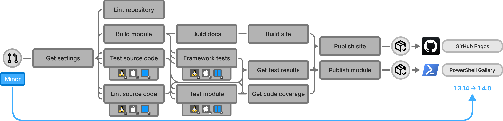

# Process-PSModule

A workflow for the PSModule process, stitching together the `Initialize`, `Build`, `Test`, and `Publish` actions to create a complete
CI/CD pipeline for PowerShell modules. The workflow is used by all PowerShell modules in the PSModule organization.

## Specifications and practices

Process-PSModule follows:

- [Test-Driven Development](https://testdriven.io/test-driven-development/) using [Pester](https://pester.dev) and [PSScriptAnalyzer](https://learn.microsoft.com/en-us/powershell/utility-modules/psscriptanalyzer/overview?view=ps-modules)
- [GitHub Flow specifications](https://docs.github.com/en/get-started/using-github/github-flow)
- [SemVer 2.0.0 specifications](https://semver.org)
- [Continiuous Delivery practices](https://en.wikipedia.org/wiki/Continuous_delivery)

## How it works

The workflow is designed to be trigger on pull requests to the repository's default branch.
When a pull request is opened, closed, reopened, synchronized (push), or labeled, the workflow will run.
Depending on the labels in the pull requests, the workflow will result in different outcomes.



- [Test-PSModule](https://github.com/PSModule/Test-PSModule/) - Tests the source code using PSScriptAnalyzer, PSModule source code tests suites. This runs on 4 different environments to check compatibility.
  - PowerShell 7.x on Windows, Ubuntu and macOS.
  - Windows PowerShell 5.1 on Windows.
- [Build-PSModule](https://github.com/PSModule/Build-PSModule/) - Compiles the repository into an efficient PowerShell module.
- [Test-PSModule](https://github.com/PSModule/Test-PSModule/) - Tests the compiled module using PSScriptAnalyzer, PSModule module tests and custom module tests from the module repository. This runs on 4 different environments to check compatibility.
  - PowerShell 7.x on Windows, Ubuntu and macOS.
  - Windows PowerShell 5.1 on Windows.
- [Publish-PSModule](https://github.com/PSModule/Publish-PSModule/) - Publishes the module to the PowerShell Gallery, docs to GitHub Pages, and creates a release on the GitHub repository.

To use the workflow, create a new file in the `.github/workflows` directory of the module repository and add the following content.
<details>
<summary>Workflow suggestion</summary>

```yaml
name: Process-PSModule

on:
  pull_request:
    branches:
      - main
    types:
      - closed
      - opened
      - reopened
      - synchronize
      - labeled

concurrency:
  group: ${{ github.workflow }}-${{ github.ref }}
  cancel-in-progress: true

permissions:
  contents: write
  pull-requests: write

jobs:
  Process-PSModule:
    uses: PSModule/Process-PSModule/.github/workflows/workflow.yml@v2
    secrets: inherit

```
</details>

## Usage

### Inputs

| Name | Type | Description | Required | Default |
| ---- | ---- | ----------- | -------- | ------- |
| `Name` | `string` | The name of the module to process. This defaults to the repository name if nothing is specified. | `false` | N/A |
| `Path` | `string` | The path to the source code of the module. | `false` | `src` |
| `ModulesOutputPath` | `string` | The path to the output directory for the modules. | `false` | `outputs/modules` |
| `DocsOutputPath` | `string` | The path to the output directory for the documentation. | `false` | `outputs/docs` |
| `PublishDocs` | `boolean` | Whether to publish the documentation using MkDocs and GitHub Pages. | `false` | `true` |
| `SiteOutputPath` | `string` | The path to the output directory for the site. | `false` | `outputs/site` |
| `SkipTests` | `string` | Defines what types of tests to skip. Allowed values are 'All', 'SourceCode', 'Module', 'None', 'macOS', 'Windows', 'Linux'. | `false` | `None` |
| `TestProcess` | `boolean` | Whether to test the process. | `false` | `false` |
| `Version` | `string` | The version of the 'GitHub' module to use. Defaults to latest version. | `false` | N/A |
| `Prerelease` | `boolean` | Whether to use a prerelease version of the 'GitHub' module. | `false` | `false` |
| `VerbosePreference` | `string` | The preference for verbose output. Allowed values: 'SilentlyContinue', 'Stop', 'Continue', 'Inquire', 'Break', 'Ignore','Suspend'. | `false` | `SilentlyContinue` |
| `DebugPreference` | `string` | The preference for debug output. Allowed values: 'SilentlyContinue', 'Stop', 'Continue', 'Inquire', 'Break', 'Ignore','Suspend'. | `false` | `SilentlyContinue` |

### Secrets

The following secrets are used by the workflow. They can be automatically provided (if available) by setting the `secrets: inherit`
in the workflow file.

| Name | Location | Description | Default |
| ---- | -------- | ----------- | ------- |
| `GITHUB_TOKEN` | `github` context | The token used to authenticate with GitHub. | `${{ secrets.GITHUB_TOKEN }}` |
| `APIKey` | GitHub secrets | The API key for the PowerShell Gallery. | N/A |
| `TEST_APP_CLIENT_ID` | GitHub secrets | The client ID for running tests. | N/A |
| `TEST_APP_PRIVATE_KEY` | GitHub secrets | The private key for running tests. | N/A |
| `TEST_FG_PAT` | GitHub secrets | The fine-grained personal access token for running tests. | N/A |
| `TEST_PAT` | GitHub secrets | The classic personal access token for running tests. | N/A |

## Permissions

The action requires the following permissions:

If running the action in a restrictive mode, the following permissions needs to be granted to the action:

```yaml
permissions:
  contents: write      # Create releases
  pull-requests: write # Create comments on the PRs
  statuses: write      # Update the status of the PRs from the linter
```

### Publishing to GitHub Pages

To publish the documentation to GitHub Pages, the action requires the following permissions:

```yaml
permissions:
  pages: write    # Deploy to Pages
  id-token: write # Verify the deployment originates from an appropriate source
```

For more info see [Deploy GitHub Pages site](https://github.com/marketplace/actions/deploy-github-pages-site).

## Compatibility

The action is compatible with the following configurations:

| OS | Shell |
| --- | --- |
| windows-latest | pwsh |
| macos-latest | pwsh |
| ubuntu-latest | pwsh |
