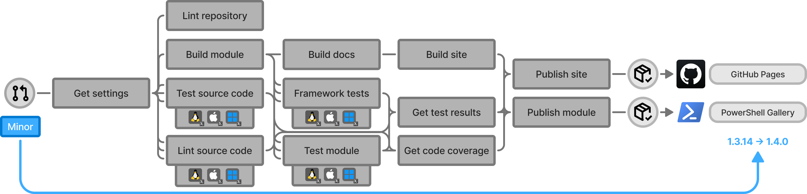

# Process-PSModule

An end-to-end PowerShell module pipeline that automates the entire lifecycle of a module: building from source, running
cross-platform tests, enforcing code quality and coverage, generating documentation, and publishing the versioned module
to the PowerShell Gallery and its documentation site to GitHub Pages. It is the core workflow used across all PowerShell
modules in the [PSModule organization](https://github.com/PSModule), ensuring reliable, automated, and maintainable
delivery of PowerShell projects.

## How it works

The workflow is triggered on pull requests to the repository's default branch. When a pull request is opened, closed,
reopened, synchronized (push), or labeled, the workflow runs. Depending on the labels on the pull request, the
[workflow results in different outcomes](reference/scenario-matrix.md).

Everything is packaged into a single reusable workflow so that a module repository only needs a small caller workflow
and one settings file. A user configures the behaviour by editing `.github/PSModule.yml`.

## Start here

New to Process-PSModule? Work through these in order.

| Page | Description |
| --- | --- |
| [Get started](get-started/index.md) | Create a module repository from the template and get the pipeline running. |
| [Repository setup](get-started/repository-setup.md) | Configure GitHub Pages, the PowerShell Gallery API key, permissions, and the caller workflow. |
| [Your first release](get-started/your-first-release.md) | The pull request flow, version labels, and what happens on merge. |

## Guides

Task-oriented deep dives into the pipeline's functionality.

| Page | Description |
| --- | --- |
| [Calling the workflow](guides/calling-the-workflow.md) | The caller workflow, passing test secrets and variables with `TestData`, and important-file change detection. |
| [Configuring the pipeline](guides/configuring-the-pipeline.md) | Worked examples for coverage targets, rapid testing, linting, and PR-based release notes. |
| [Structuring your module](guides/structuring-your-module.md) | The repository and module source layout the workflow expects, and how to declare dependencies. |
| [Writing module tests](guides/writing-module-tests.md) | Test discovery, setup and teardown phases, and shared test infrastructure. |
| [Skipping framework tests](guides/skipping-framework-tests.md) | Skip individual framework tests on a per-file basis. |
| [Versioning and releases](guides/versioning-and-releases.md) | Label-driven versioning, prereleases, and what a release produces. |
| [Validating before review](guides/validating-before-review.md) | The PSModule validation pass before a draft pull request is marked ready. |

## Reference

Look up the exact contract.

| Page | Description |
| --- | --- |
| [Settings](reference/settings.md) | Every available setting in `.github/PSModule.yml` and the full defaults. |
| [Workflow inputs](reference/workflow-inputs.md) | Inputs, secrets, and permissions of the reusable workflow. |
| [Pipeline stages](reference/pipeline-stages.md) | The job-by-job breakdown, from Plan through Publish Docs. |
| [Scenario matrix](reference/scenario-matrix.md) | Which jobs run for each trigger scenario. |
| [Framework test IDs](reference/framework-test-ids.md) | The framework tests enforced on source code and on the built module. |
| [Dependencies](reference/dependencies.md) | The actions, modules, and services the workflow composes. |

## Specification

The requirements and architecture behind the pipeline. Primarily for those maintaining Process-PSModule itself.

| Page | Description |
| --- | --- |
| [Specification](specification/index.md) | Spec, design, and the principles that guide both. |
