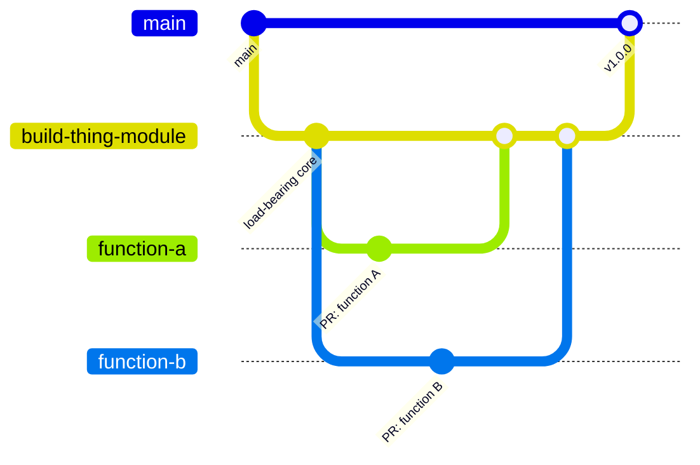

# Module bootstrap

A brand-new module usually has a small **load-bearing core**: the piece(s) every other function will depend on, without which nothing else in the module can work at all. A single feature PR cannot carry that much scope and still be small and focused, so bootstrap uses one integration branch instead.

## Identify the load-bearing core first

What counts as "load-bearing" follows the module's archetype from [Module types](../reference/module-types.md):

- **Data modules** — the conversion pivot: `ConvertFrom-<Format>` / `ConvertTo-<Format>` (and whatever parser/serializer they wrap). Every other function (`Import-`, `Export-`, `Format-`, `Merge-`, ...) is built on top of this pivot and is meaningless without it.
- **Integration (API) modules** — a [`Context`](https://github.com/PSModule/Context)-backed credential/config store, the client setup that uses it, and at least one API function that consumes the context end-to-end. Every other API function needs the same context and client to do anything.

Scope the integration branch to exactly that core, not to everything planned for v1. Keeping it to the minimum that "everyone needs" gets a usable release out faster, and lets independent follow-up functions be developed in parallel — by different people or agents — as soon as the core is stable enough to build against, even before it merges.

## Pattern

1. Cut one long-lived branch from the default branch for the initial release, named for the outcome, e.g. `build-thing-module`.
2. Open one pull request per function (or small group of related functions) targeting that branch instead of `main`. These PRs can land in parallel — there is no strict order between them, unlike a [stacked pull request](https://msx.no/docs/Ways-of-Working/Branching-and-Merging/#stacked-pull-requests).
3. Once the load-bearing core is coherent and complete, open the pull request that merges the integration branch into `main`. This becomes the module's first real release (`v1.0.0`).
4. Smaller follow-up features (one more function, a formatter, an alias) can keep targeting the integration branch before it lands, the same way they targeted it during bootstrap.

## After the core lands

Once the core has merged as `v1.0.0`, ordinary [SemVer](../reference/versioning.md) applies: a new function built on the stable core is a **minor** bump, a fix is a **patch** bump, and only a change to the core's own contract (signature, exported class shape, behavior) is a **major** bump. No special versioning exception is needed once the core is in place — the bootstrap phase exists only to get that core to a first release quickly.

`function-a` and `function-b` are independent — both cut from `build-thing-module` and merged back in any order, unlike a stacked pull request where each layer depends on the one before it.

## Example

A module bootstrapped this way:

| PR | Targets | Contents |
| --- | --- | --- |
| #1 | `main` | `build-thing-module` branch, the load-bearing core (e.g. conversion pivot, or context + client + first API function) |
| #2 | `build-thing-module` | a follow-up function built on the core, added before the integration branch merged |

## When to use this

- The module has no usable release yet, and the load-bearing core hasn't landed.
- Use this only for the initial bootstrap. Once `main` has a first release, ongoing feature work targets `main` directly with ordinary topic branches, or a [stacked pull request](https://msx.no/docs/Ways-of-Working/Branching-and-Merging/#stacked-pull-requests) when changes genuinely depend on each other.

For the general branching and merge model, see [MSX Branching and Merging](https://msx.no/docs/Ways-of-Working/Branching-and-Merging/).
