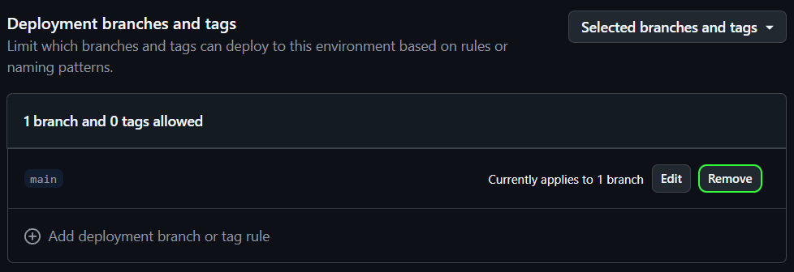

# Repository setup

Do this once per module repository, after creating it from
[Template-PSModule](https://github.com/PSModule/Template-PSModule).

## 1. Enable GitHub Pages

Enable GitHub Pages in the repository settings and set it to deploy from **GitHub Actions**.

This creates an environment called `github-pages` that GitHub deploys the documentation site to.

<details><summary>Within the <code>github-pages</code> environment, remove the branch protection for <code>main</code>.</summary>
  
</details>

## 2. Create `PSGALLERY_API_KEY`

1. [Create an API key on the PowerShell Gallery](https://www.powershellgallery.com/account/apikeys). Give it permission
   to manage the module you are working on.
2. Create a repository or organization secret called `PSGALLERY_API_KEY` and set the API key as its value.

If you plan to create many modules, use a glob pattern for the API key permissions in the PowerShell Gallery and store
`PSGALLERY_API_KEY` on the organization instead of on each repository.

## 3. Add the caller workflow

Create `.github/workflows/Process-PSModule.yml` in the module repository:

```yaml
name: Process-PSModule

on:
  workflow_dispatch:
  schedule:
    - cron: '0 0 * * *'
  push:
    branches:
      - main
  pull_request:
    branches:
      - main
    types:
      - closed
      - opened
      - reopened
      - synchronize
      - labeled
      - unlabeled

concurrency:
  group: ${{ github.workflow }}-${{ github.event.pull_request.number || github.ref }}
  cancel-in-progress: false

permissions:
  contents: write
  pull-requests: write
  statuses: write
  pages: write
  id-token: write

jobs:
  Process-PSModule:
    uses: PSModule/Process-PSModule/.github/workflows/workflow.yml@v5
    secrets:
      PSGALLERY_API_KEY: ${{ secrets.PSGALLERY_API_KEY }}
      GitHubAppClientId: ${{ secrets.SHELLY_CLIENT_ID }}
      GitHubAppPrivateKey: ${{ secrets.SHELLY_PRIVATE_KEY }}
```

Every permission in that block is required. A push to `main` publishes a stable release after the full pipeline passes;
the pull-request trigger handles CI, prereleases, and prerelease cleanup. See
[Workflow inputs](../reference/workflow-inputs.md) for what each permission is used for, and
[Calling the workflow](../guides/calling-the-workflow.md) for passing test secrets and variables.

## 4. Add the settings file

Create `.github/PSModule.yml`. An empty file is valid — every setting has a default:

```yaml
Name: null
```

See [Settings](../reference/settings.md) for the full contract and
[Configuring the pipeline](../guides/configuring-the-pipeline.md) for worked examples.

## 5. Configure the documentation site

Process-PSModule builds documentation with [Zensical](https://zensical.org/) from `.github/zensical.toml`. The template
ships a working file; update the site name and repository links to match the module.

## Next

Open a pull request and let the pipeline run — see [Your first release](your-first-release.md).
