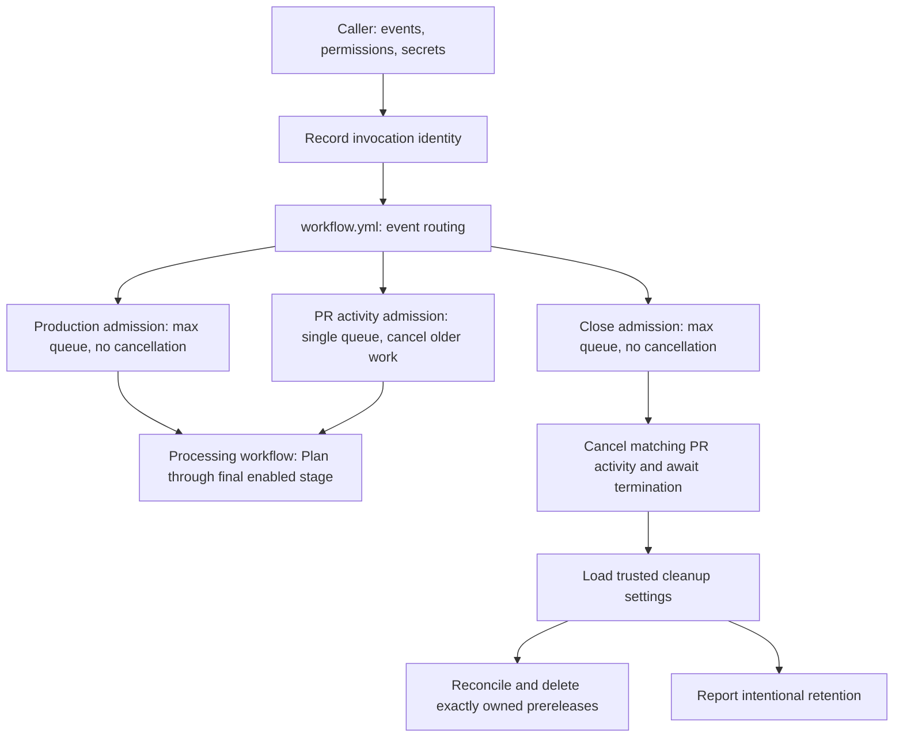

# Workflow triggers - Design

The reusable entry point, `.github/workflows/workflow.yml`, routes events into concurrency-controlled calls to processing or cleanup workflows. Native admission owns queuing; the close path reconciles cancellation and resource ownership before deletion. No external queue service or caller-side dispatcher is required.

## Specification

[Workflow triggers - Spec](spec.md) defines the behavior. The [framework design](../design.md) owns the processing stages and settings contract.

## Approach

Use three mutually exclusive entry jobs with literal concurrency policies. The production and activity jobs each call the complete processing workflow, retaining their concurrency slot until its nested jobs finish. The close job calls only closure coordination and cleanup. A small framework-owned preflight records invocation identity before these jobs become eligible; it performs no planning, version resolution, or module execution.

This avoids an expression-valued `queue` and a short-lived admission job that releases its slot before the pipeline starts. A live GitHub.com experiment accepted an expression-valued `queue` for an uncontended run and for pull-request replacement, but concurrent production invocations failed before creating jobs rather than entering the `max` queue. The framework therefore uses literal policies. `Plan` and version resolution execute inside the processing call, after admission.

### Platform contract

| Concern | Contract |
| --- | --- |
| Retained queue | `queue: max` permits **100 pending executions plus one running execution** per group. |
| Overflow | Additional executions are canceled when the pending queue is full; the limit cannot be increased by support. |
| Replacement queue | `queue: single` is the default. A newcomer replaces an existing pending execution even when `cancel-in-progress` is `false`. |
| Ordering | FIFO by the time work starts waiting for the concurrency group, **not** by push, commit, or workflow-dispatch time. |
| Valid combinations | `queue: max` requires `cancel-in-progress: false` or omission. Combining it with `true` is invalid. |
| Group scope | Repository-local and case-insensitive. Caller and called workflow must not acquire the same group. |
| Other limits | The workflow lifetime limit includes waiting; event-trigger rate limits also apply. A 100-entry group is not an unlimited durable queue. |

These are [GitHub's concurrency guarantees][concurrency] and [Actions limits][limits]. The native queue meets the accepted bounded-retention contract, not strict chronological push ordering.

### Alternatives considered

| Option | Trade-offs | Verdict |
| --- | --- | --- |
| Internal router with literal per-track policies | Adds one reusable-workflow layer; keeps caller configuration small and protects the complete pipeline. | Chosen. |
| One conditional workflow-level group | Fewer internal jobs, but a conditional `queue` plus conditional cancellation fails concurrent production admission before jobs run. A static `max` queue cannot cancel PR activity; a static `single` queue cannot retain the production burst. | Rejected. |
| Caller-owned concurrency | Can protect the entire caller, but duplicates policy and can discard work before the framework receives it. | Rejected for the standard caller. |
| One cancelable group for activity and closure | Close can supersede activity natively, but reopening or another update can cancel cleanup. | Rejected. |
| Concurrency only on publication or on a short admission job | Allows planning/version races or releases the lock before processing ends. | Rejected. |
| Durable external dispatcher | Can provide stronger ordering and retention but adds persistent state and operational ownership. | Outside the bounded native-queue contract. |

## Architecture



### Event routing

Routing uses the original `github` event context. The called workflow sees the caller's context; it does not receive `workflow_call` as a replacement business event. Routing does not require the settings file.

| Event | Track | Execution |
| --- | --- | --- |
| `push` to `github.event.repository.default_branch` | Production | Full processing; existing change detection and release gates still apply. |
| `workflow_dispatch` on the default branch | Production | Same serialization and stable-release policy as the supported manual path. |
| `pull_request`: `opened`, `reopened`, `synchronize`, `labeled`, `unlabeled` | PR activity | Replace obsolete work; validate live PR state before processing and publication. |
| `pull_request`: `closed`, whether merged or abandoned | Close | Stop activity, then evaluate optional cleanup; never enter the processing DAG. |
| Optional `schedule`, or manual validation on another branch | Validation | Nonpublishing processing, isolated from production and closure; latest-per-ref admission. |
| Other events or actions | Unsupported | Explicitly report no supported route; never fall through into publication. |

Default-branch identity comes from the event's repository metadata rather than a hard-coded `main`. Caller branch filters still name the repository's actual default branch. A merged close event can have the default-branch `github.ref`, so PR identity always uses the PR number, not that ref.

### Admission boundary and keys

The framework namespace is `Process-PSModule-${{ github.workflow }}`. One stable-named caller owns a module's production path; different caller names are not a substitute for coordinating two publishers of the same module.

| Track | Group suffix | Queue | Cancel in progress |
| --- | --- | --- | --- |
| Production | `-production` | `max` | `false` |
| PR activity | `-pr-<number>` | `single` | `true` |
| Close | `-close-pr-<number>` | `max` | `false` |
| Optional validation | `-validation-<ref>` | `single` | `true` |

Each group belongs to the router's `uses` job, not to `Plan`, each matrix leg, or every nested workflow. [Reusable-workflow calling jobs support concurrency][reusable]. The processing workflow does not reacquire the router's group. Only one track job is eligible per invocation.

With a default-deny workflow permission floor, every router job calling a nested reusable workflow MUST declare the
least-privilege permissions its child requires. A nested workflow can restrict, but cannot elevate, its caller's
`GITHUB_TOKEN`. This is independent of any scoped GitHub App token minted inside the child.

For example, this production-job excerpt depends on the preflight job; its reusable target contains the complete processing DAG:

```yaml
jobs:
  Production:
    needs: Record-Invocation
    if: >-
      (github.event_name == 'push' || github.event_name == 'workflow_dispatch') &&
      github.ref == format('refs/heads/{0}', github.event.repository.default_branch)
    concurrency:
      group: Process-PSModule-${{ github.workflow }}-production
      queue: max
      cancel-in-progress: false
    permissions:
      contents: read
      pages: write
      id-token: write
    uses: ./.github/workflows/Process.yml
    secrets:
      PSGALLERY_API_KEY: ${{ secrets.PSGALLERY_API_KEY }}
      GitHubAppClientId: ${{ secrets.GitHubAppClientId }}
      GitHubAppPrivateKey: ${{ secrets.GitHubAppPrivateKey }}
      TestData: ${{ secrets.TestData }}
    with:
      SettingsPath: ${{ inputs.SettingsPath }}
      WorkingDirectory: ${{ inputs.WorkingDirectory }}
      ImportantFilePatterns: ${{ inputs.ImportantFilePatterns }}
      Debug: ${{ inputs.Debug }}
      Verbose: ${{ inputs.Verbose }}
      Version: ${{ inputs.Version }}
      Prerelease: ${{ inputs.Prerelease }}
```

The public inputs and secrets remain unchanged. Internal filenames and job identifiers do not become caller inputs. The extra nesting level stays within GitHub's reusable-workflow depth limit. Changing job paths requires updating required checks rather than silently removing a merge gate.

### Minimal caller

The caller subscribes to default-branch pushes and all supported PR actions. It has **no workflow-level or calling-job concurrency block**. Manual runs and schedules are optional, not prerequisites for the three tracks.

```yaml
name: Process-PSModule

on:
  push:
    branches: [main]
  pull_request:
    branches: [main]
    types: [opened, reopened, synchronize, labeled, unlabeled, closed]

permissions: {}

jobs:
  Process-PSModule:
    permissions:
      contents: read
      pages: write
      id-token: write
    uses: PSModule/Process-PSModule/.github/workflows/workflow.yml@v8
    secrets:
      PSGALLERY_API_KEY: ${{ secrets.PSGALLERY_API_KEY }}
      GitHubAppClientId: ${{ secrets.SHELLY_CLIENT_ID }}
      GitHubAppPrivateKey: ${{ secrets.SHELLY_PRIVATE_KEY }}
```

This is the caller contract for the router design, not evidence that an arbitrary existing `v8` pin implements it. Consumers select a framework release carrying the contract during rollout. Test data and other optional inputs follow the [workflow input contract](../../reference/workflow-inputs.md).

Caller path filters must not suppress required closure handling. Duplicating subscriptions in multiple caller workflows, using `pull_request_target` as an interchangeable event, or adding an outer concurrency block is outside this standard caller contract. No inner workflow can restore work discarded by an outer queue.

### Production and activity execution

Production holds admission across planning, quality gates, publication, documentation deployment, and enabled teardown. Every checkout and publication target uses the run's recorded commit, not a freshly resolved branch tip. Version resolution reads the release state after prior admitted production work terminates.

PR preflight checks the live PR's open state, head SHA, lifecycle, and relevant release labels against its recorded event before requesting activity admission. The processing workflow repeats the check before expensive work and immediately before external publication. A mismatch marks the invocation obsolete rather than applying new labels to an old plan. Obsolete or closed activity reports why it stops. This also handles delayed events and reruns of obsolete revisions; arrival order alone does not establish freshness.

The preflight read and native admission are not atomic. An event delayed between them can still displace current work. If no current eligible invocation remains, the surviving stale invocation reports that the latest revision needs a full rerun; it does not publish or report a successful current validation. Normal ordered bursts converge automatically, but native cancellation is not a strict latest-commit scheduler.

Native cancellation supersedes the activity invocation, but already-running teardown or an accepted external request may finish. Freshness checks reduce stale writes; they are not an atomic transaction with PR updates. Publication records and close reconciliation handle interrupted writes rather than assuming cancellation undoes them.

### Closure coordination

The close path has its own retained admission group. Its cancellation requests use the existing GitHub App identity with repository-scoped Actions write permission.

1. Capture the PR number, closure timestamp, and lifecycle boundary from the close event and authenticated PR timeline. A lifecycle starts at opening or reopening; the boundary is fixed for the closure attempt.
2. Enumerate activity runs for the same repository and caller workflow, across every result page and all nonterminal statuses. Verify PR association and lifecycle before targeting a run. Exclude production, validation, other PRs, this closure, and all other closure runs.
3. Request cancellation of matching running or pending activity. Track run ID and attempt; a cancellation response of `202` acknowledges a request, not termination. On `409`, reread the run before deciding that concurrent completion explains the conflict.
4. Poll targeted runs and reconcile newly visible matching activity until all are terminal. Allow up to **10 minutes from the start of cancellation coordination**, including discovery and receipt availability, honoring API retry guidance. Expiry or unresolved association fails the close run before deletion; automatic force-cancellation is not used.
5. Load cleanup policy from a pinned, trusted default-branch revision, honoring `SettingsPath` and `WorkingDirectory`. With `Publish.Module.AutoCleanup: false`, report retention and stop without deleting resources. Omission means `true`.
6. With cleanup enabled, acquire the per-PR cleanup resource lock, reconcile recorded publication intents, enumerate owned resources, and delete only verified candidates. Report every outcome.

The [cancellation process][cancellation] permits conditions such as `always()` to keep jobs running. A successful cancellation HTTP request is never the cleanup barrier. Close coordination uses the [workflow-run REST API][runs], not a shell command that merely submits cancellation.

The run list is not an atomic snapshot. Filtered queries have a result ceiling, so enumeration partitions time ranges or reports incompleteness rather than trusting a full-sized truncated result. `gh run list` is not the ownership source: its default is limited and it excludes PR association payloads.

The preflight uploads an immutable, attempt-specific invocation receipt as an Actions artifact before admitting any track. It records the original event action and lifecycle without credentials or PR body content. Closure reads it through authenticated artifact metadata for that exact workflow run and attempt. This distinguishes activity from other close runs: the run-list API's `event=pull_request` filter alone cannot distinguish their actions.

For runs created before closure, authenticated workflow/PR association and the closure boundary identify candidates; the receipt proves activity classification and lifecycle. A not-yet-started run can need time to produce its receipt. Missing, expired, or ambiguous evidence remains subject to the coordination deadline and fails quiescence rather than authorizing cancellation of unrelated work. Receipt retention covers the supported active-run lifetime; a repository retention policy that cannot preserve it is reported during adoption.

Delayed pre-close events that become runs after the closure boundary fail the live-state/lifecycle admission check before publishing. A reopened PR's new activity and publication records belong to another lifecycle and are preserved, even if the earlier cleanup starts late. An old run attempt cannot acquire a new lifecycle merely by being rerun.

### Resource reconciliation

Publication writes durable ownership before its first externally visible package publication: a framework-authored annotated prerelease tag and draft prerelease release carry the provenance below. Prerelease identities incorporate the owning run and attempt in a SemVer- and Gallery-compatible form and are never reused by another owner, even after deletion. Existing resources with conflicting provenance are rejected, not overwritten. The draft becomes the published GitHub prerelease when publication succeeds.

This record allows cleanup to find interrupted publication even when no published GitHub Release exists. Tag enumeration and release enumeration are both paginated. A branch-name substring, sanitized branch name, or commit SHA alone is not proof of ownership. Human release notes are separate from machine-readable provenance.

Cleanup selects records for the closing lifecycle, including earlier still-unreconciled lifecycles of that PR, but excludes every later reopening. It verifies the resource remains a prerelease or an owned prerelease reservation, excludes stable and retained publication tags, and confirms the tag target and recorded identity before deletion. Releases are deleted by exact release ID; tag deletion is a separate verified operation. Release `created_at` is not a lifecycle cutoff because GitHub defines it from the associated commit, not the publication time.

Deletion is repeatable: a resource already absent after a previously verified deletion is successful; authentication errors, conflicting identity, incomplete inventories, and other unresolved API failures are not. A final reconciliation reports any remaining candidate. Ambiguous legacy resources remain untouched with a failing, actionable report rather than a false claim of complete cleanup.

Cancellation cannot prove that an already-accepted remote publication was rolled back. Reconciliation resolves recorded intents against the remote resources; an unsettled external operation remains incomplete and requires retry. PowerShell Gallery package versions remain published; cleanup never claims to remove them.

Both close-triggered cleanup and the existing successful stable-publication cleanup fallback use the same resource coordinator. Its separate job-scoped group, `<namespace>-cleanup-resources-pr-<number>`, uses `queue: max` and no cancellation. It serializes deletion only, never reacquires an admission key, and retains the fixed lifecycle boundary. Close cleanup does not depend on stable publication succeeding.

## Data and contracts

| Record | Fields and use |
| --- | --- |
| Invocation | Repository identity, caller workflow identity, event/action, original event timestamp, ref, commit SHA, run ID, run attempt, and optional PR number/lifecycle. |
| Closure | PR number, fixed close timestamp/lifecycle, pinned settings revision, configured cleanup value, targeted run IDs/attempts, and cancellation deadline. |
| Prerelease provenance | Schema version, repository identity, module identity, PR number, lifecycle, originating run ID/attempt, head SHA, exact version/tag and expected target, release ID once created, and publication intent. Stored on the annotated tag and draft/published release. |
| Cleanup result | Candidates, deleted/already-absent/retained/ambiguous resources, failures, and whether enumeration and quiescence were complete. |

No scheduling value comes from settings loaded by `Plan`: job outputs arrive too late for whole-pipeline admission. The existing `Publish.Module.AutoCleanup` authoring key remains the only deletion switch; configured intent and effective event routing are recorded separately.

## Security

Normal processing retains the established secret boundary. The trusted close path runs framework-owned code, does not run module tests or checkout executable PR content, and loads only configuration data from the pinned default branch.

Cancellation uses an installation token narrowed to the caller repository with Actions write and only the read permissions required for ownership checks. Deletion uses a separate token narrowed to Contents write. Tokens are step-scoped; default `github.token` permissions do not implicitly grant or restrict these App tokens.

The GitHub App installation must grant the added Actions permission; no new secret is required. Fork PRs and Dependabot runs do not automatically receive privileged secrets. The standard caller does not promise privileged cleanup in those contexts; an explicitly designed trusted handoff is required. Substituting `pull_request_target` and running PR code with secrets is not that handoff.

## Testing strategy

| Coverage | Required evidence |
| --- | --- |
| Routing contracts | Table-driven tests for every event/action, custom default branches, merged and abandoned closure, unsupported events, and no publication from validation. |
| Caller and nesting contracts | No outer concurrency; literal queue policies; one eligible track; every input/secret forwarded; no nested reacquisition; required-check names accounted for. |
| Production admission | A disposable nonpublishing harness holds A while B and C wait; all complete serially and retain their SHAs. Include push/manual overlap and a failed A. |
| Capacity boundary | In a controlled harness, hold one active invocation, admit 100 pending, then exceed capacity and record the extra invocation's platform cancellation. Do not generate real releases for this test. |
| PR convergence | Three rapid pushes, repeated head SHA with changed labels, label removal, delayed delivery, obsolete reruns, and two independent PRs. |
| Close barrier | Cancel accepted but still running, `always()` teardown, concurrent completion/409, pagination, ambiguous membership, deadline expiry, and run-attempt changes. Assert zero deletion before the barrier. |
| Cleanup ownership | Multiple pages, branch-name collisions, missing branches/labels, interrupted draft/tag creation, already-absent resources, legacy ambiguity, and preserved stable/other-PR/later-lifecycle resources. |
| Lifecycle integration | Close during publication, reopen before cleanup, duplicate close, simultaneous merge push, disabled cleanup, and overlapping stable fallback cleanup. |

Use the existing Pester action-test runner for pure routing, ownership, and mocked API behavior. Real GitHub integration evidence is required for scheduling and nested cancellation; parser success and mocked tests cannot establish those platform properties. Public package registries are not test targets.

## Rollout and operability

Adoption couples a framework release containing the router with removal of caller concurrency. Until both changes are present, the caller's old one-pending policy can still discard production work or prevent PR supersession. The setup guide, calling guide, fixture callers, module template, and v8 upgrade guidance carry the same caller contract.

The additional App Actions permission, receipt retention, changed required-check paths, trusted cleanup settings source, and non-reused prerelease identity/provenance format are explicit migration items. Legacy prereleases are inventoried before enabling destructive cleanup; ambiguous ownership requires operator reconciliation, not automatic substring deletion. A dry-run report uses the same enumeration and ownership checks without mutation.

Admission overflow can occur before a processing job runs, so GitHub's run status is the authoritative overflow signal. Operators inspect canceled/expired production entries and use controlled full-run recovery after reconciling publication state. Publication rejects planning outputs from a different run attempt. Partial reruns that reuse old planning outputs are not a fresh production release; recovery must reenter the serialization boundary and must not republish an already-published version.

Close summaries include the canceled activity, lifecycle cutoff, policy revision, deleted/retained resources, and failures. A failed barrier is retried only after checking the named activity; failed deletion is rerun against the same ownership scope. Neither failure is hidden behind an unconditional successful summary.

[concurrency]: https://docs.github.com/en/actions/how-tos/write-workflows/choose-when-workflows-run/control-workflow-concurrency
[limits]: https://docs.github.com/en/actions/reference/limits
[reusable]: https://docs.github.com/en/actions/reference/workflows-and-actions/reusing-workflow-configurations
[cancellation]: https://docs.github.com/en/actions/reference/workflows-and-actions/workflow-cancellation
[runs]: https://docs.github.com/en/rest/actions/workflow-runs
