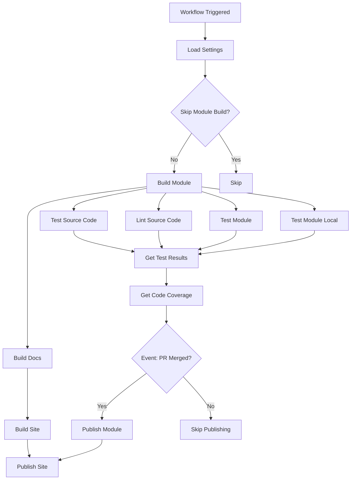

# Data Model: Unified CI/CD Workflow

**Feature**: 001-unified-workflow
**Date**: 2025-10-02

## Overview

This feature involves workflow orchestration rather than traditional data persistence. The "entities" in this context are GitHub Actions workflow constructs, events, and runtime state. No database or file storage is required.

## Entities

### 1. Workflow Configuration (workflow.yml)

**Description**: The unified YAML workflow file that orchestrates all CI/CD operations

**Attributes**:
| Attribute | Type | Validation | Description |
|-----------|------|------------|-------------|
| name | string | Required | Workflow display name |
| on | object | Required | Trigger configuration (workflow_call) |
| permissions | object | Required | Permission scopes for workflow |
| jobs | object | Required | Job definitions and execution order |
| secrets | object | Required | Secret definitions passed to workflow |
| inputs | object | Required | Input parameters for workflow customization |

**State Transitions**:
1. **Defined** → Workflow file committed to repository
2. **Triggered** → Event occurs (PR or merge)
3. **Queued** → GitHub Actions queues workflow run
4. **Running** → Jobs execute based on conditions
5. **Completed** → All jobs finish (success/failure)

**Relationships**:
- Contains multiple Job entities
- Invokes multiple Reusable Workflow entities
- Consumes Secrets and Inputs
- Produces WorkflowRun entity

**Validation Rules**:
- YAML syntax must be valid
- All referenced jobs must exist or be conditionally skipped
- Required secrets must be defined
- Event triggers must be valid GitHub event types

---

### 2. GitHub Event Context

**Description**: Runtime information about the event that triggered the workflow

**Attributes**:
| Attribute | Type | Validation | Description |
|-----------|------|------------|-------------|
| event_name | enum | Required | Type of event (pull_request, push, etc.) |
| action | string | Optional | Specific action (opened, synchronized, closed) |
| pull_request.merged | boolean | Optional | Whether PR was merged (null if not applicable) |
| ref | string | Required | Git reference (branch, tag) |
| repository.default_branch | string | Required | Name of default branch (usually 'main') |

**State Transitions**: Immutable (read-only context provided by GitHub)

**Relationships**:
- Consumed by Workflow Configuration for conditional logic
- Determines Job execution
- Affects Concurrency Group calculation

**Validation Rules**:
- Event context provided by GitHub (trusted source)
- Conditional expressions must handle null values gracefully

---

### 3. Job Definition

**Description**: Individual unit of work within the unified workflow

**Attributes**:
| Attribute | Type | Validation | Description |
|-----------|------|------------|-------------|
| id | string | Required | Unique job identifier |
| uses | string | Optional | Path to reusable workflow (if applicable) |
| needs | array[string] | Optional | List of job IDs that must complete first |
| if | string | Optional | Conditional expression for execution |
| strategy | object | Optional | Matrix strategy for parallel execution |
| with | object | Optional | Inputs passed to reusable workflow |
| secrets | object | Optional | Secrets passed to reusable workflow |

**State Transitions**:
1. **Pending** → Waiting for dependencies (needs)
2. **Skipped** → Condition evaluated to false
3. **Queued** → Dependencies met, waiting for runner
4. **Running** → Executing on runner
5. **Success** → Completed successfully
6. **Failure** → Failed with error
7. **Cancelled** → Cancelled by user or concurrency group

**Relationships**:
- Part of Workflow Configuration
- May depend on other Jobs (via needs)
- May invoke Reusable Workflow
- Produces Job Outputs

**Validation Rules**:
- Job IDs must be unique within workflow
- All jobs referenced in `needs` must exist
- Conditional expressions must be valid

---

### 4. Concurrency Group

**Description**: Mechanism to control concurrent workflow executions

**Attributes**:
| Attribute | Type | Validation | Description |
|-----------|------|------------|-------------|
| group | string | Required | Unique identifier for concurrency group |
| cancel-in-progress | boolean | Required | Whether to cancel in-progress runs |

**Calculation Logic**:
```yaml
group: ${{ github.workflow }}-${{ github.ref }}
cancel-in-progress: ${{ github.ref != format('refs/heads/{0}', github.event.repository.default_branch) }}
```

**State Transitions**:
1. **Created** → Workflow run starts
2. **Active** → Workflow run in progress
3. **Cancelled** → Run cancelled by new run in same group (if cancel-in-progress: true)
4. **Completed** → Run finishes

**Relationships**:
- Associated with Workflow Run
- Determines which runs can execute concurrently

**Validation Rules**:
- Group name must be valid expression
- Cancel-in-progress must evaluate to boolean

---

### 5. Workflow Run

**Description**: A single execution instance of the workflow

**Attributes**:
| Attribute | Type | Validation | Description |
|-----------|------|------------|-------------|
| id | integer | Auto-generated | Unique run ID |
| workflow_id | integer | Required | ID of workflow definition |
| event | string | Required | Event that triggered run |
| status | enum | Required | queued, in_progress, completed |
| conclusion | enum | Optional | success, failure, cancelled, skipped |
| created_at | datetime | Auto-generated | When run was created |
| updated_at | datetime | Auto-generated | Last update time |
| html_url | string | Auto-generated | URL to view run |

**State Transitions**:
1. **Queued** → Run created and queued
2. **In Progress** → Jobs are executing
3. **Completed** → All jobs finished
   - **Success** → All jobs succeeded
   - **Failure** → At least one job failed
   - **Cancelled** → Run was cancelled
   - **Skipped** → All jobs skipped due to conditions

**Relationships**:
- Instance of Workflow Configuration
- Contains multiple Job Runs
- Part of Concurrency Group
- Associated with GitHub Event Context

**Validation Rules**:
- Only one active run per concurrency group (if cancel-in-progress: false)
- Status must transition in valid sequence

---

### 6. Settings Configuration

**Description**: Repository-specific configuration from `.github/PSModule.yml`

**Attributes**:
| Attribute | Type | Validation | Description |
|-----------|------|------------|-------------|
| Name | string | Optional | Module name (defaults to repo name) |
| Build.Module.Skip | boolean | Optional | Whether to skip module build |
| Build.Docs.Skip | boolean | Optional | Whether to skip docs build |
| Build.Site.Skip | boolean | Optional | Whether to skip site build |
| Test.Module.Skip | boolean | Optional | Whether to skip module tests |
| Publish.Module.Skip | boolean | Optional | Whether to skip module publish |
| Publish.Site.Skip | boolean | Optional | Whether to skip site publish |

**State Transitions**: Loaded at workflow start, immutable during run

**Relationships**:
- Consumed by Get-Settings job
- Controls conditional job execution
- Passed to downstream jobs

**Validation Rules**:
- Must be valid YAML/JSON/PSD1 format
- Boolean flags must be true/false (not truthy/falsy)

---

## Workflow Execution Flow



## Conditional Logic Matrix

| Event | PR Merged? | Execute Tests? | Execute Publish? | Execute Site? |
|-------|------------|----------------|------------------|---------------|
| PR opened | No | Yes | No | No |
| PR synchronized | No | Yes | No | No |
| PR reopened | No | Yes | No | No |
| PR closed (merged) | Yes | Yes | Yes (if tests pass) | Yes (if tests pass) |
| PR closed (not merged) | No | No | No | No |

## Validation Rules Summary

1. **Workflow File**:
   - Must be valid YAML syntax
   - Must define all required jobs
   - Must reference existing reusable workflows

2. **Event Context**:
   - Must handle null values in conditional expressions
   - Must correctly differentiate PR vs merge contexts

3. **Job Dependencies**:
   - Jobs with `needs` must wait for dependencies
   - Circular dependencies are not allowed
   - Failed dependencies cause dependent jobs to skip

4. **Concurrency**:
   - Only one active run per concurrency group (if cancel-in-progress: false)
   - PR builds can cancel previous in-progress runs
   - Main branch builds must complete without cancellation

5. **Publishing**:
   - Publish jobs only execute if tests pass
   - Publish jobs only execute on merged PRs (main branch context)
   - Required secret (APIKey) must be provided

## Data Flow

1. **Input**: GitHub event (PR opened/synchronized/merged) + Repository configuration
2. **Processing**: Workflow orchestrates jobs based on conditions and dependencies
3. **Output**: Test results, built artifacts, published module (if merged), deployed docs (if merged)

## State Management

- **GitHub Actions Runner**: Ephemeral execution environment, no persistent state
- **Artifacts**: Temporary storage for build outputs between jobs
- **Releases**: Persistent storage for published module versions
- **GitHub Pages**: Persistent storage for deployed documentation

## Notes

- This is a state machine orchestration model, not a traditional database schema
- All state is managed by GitHub Actions runtime; no custom state persistence required
- Workflow files are declarative configuration; GitHub Actions handles execution state
